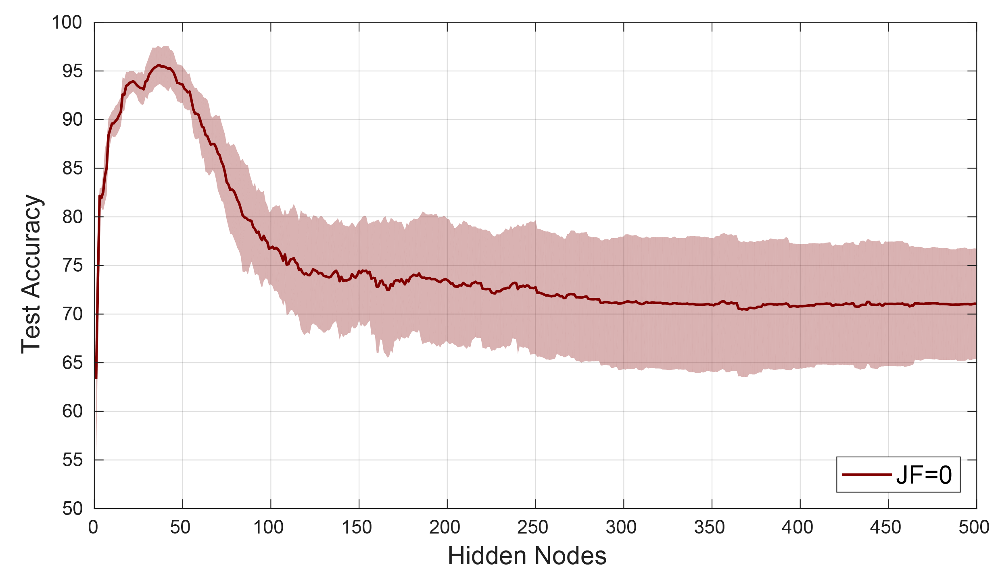

#  RELEVANCE-BASED PRUNING
This is the repository with the implementation of the proposed method: Relevance-Based Pruning proposed in https://arxiv.org/abs/1912.02154

Extreme learning machines (ELMs) suffer from the presence of unrepresentative features. This means that the number of hidden nodes must increase for the algorithm to achieve good classification results.

The following Gif shows how the amount of unrepresentative features (JF) impacts on the classification performance of an ELM. The number of training examples is 100, coincident with the overfit of the algorithm.

In our work, we explain why the overfits occur and propose a method for tuning the number of hidden nodes (M) without the need of retraining the whole network in each step.

We show that our method is available to search for the optimal number of hidden nodes, without jeopardizing classification performance. We mainly focus on the classification of electroencephalography signals, but the method can prove powerful for dealing with unrepresentative features.

## MatLab implementation
We offer an implementation of the traditional ELM and the proposed RBP method in MatLab, along with an example of the aplication of RBP in synthetic data.

## Python implementation
We also offer a python implementation of the traditional ELM and the proposed RBP method.

We develop a Colaboratory demo tutorial, that explains step by step of all the implemented functions.
